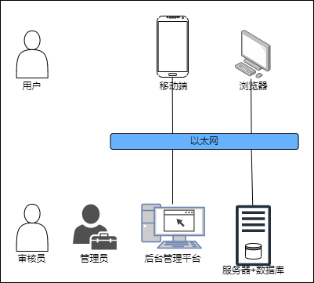

# Outline design description 

> author: wjl 2022-11-22

> still needs to be improved

## Task overview

### Target

This project is to design a cross-platform computer professional technology content sharing and exchange platform.

### Operating environment

It is planned that the server will be concentrated on a cloud server running Ubuntu 22.04 with a size of about 2C4G, and apply for a domain name for network access.

The web page provides the download address of the mobile APP.

### Requirements overview

Users can publish blogs, like, bookmark, and comment on other people's blog posts.

Blog articles have only one category, such as by domain, there are systems, algorithms, theory, artificial intelligence, and so on.

Blog posts can have multiple tags to facilitate user retrieval of content.

Users can create favorites to collect articles that users think are rewarding after reading. Favorites can be divided into public and private, and public favorites can be collected by other users.

Users create columns for their own or other people's articles, such as a series of technical tutorials, which are classified into categories for readers to read.

Users can publish their ideas. Unlike articles, the content of ideas is not long and does not have to be strongly related to technology. It is fine to post some daily ideas.

Users can write articles online, and the article editor supports Markdown syntax, supports a part of LaTex syntax, and can display mathematical formulas.

Articles that users are not satisfied with or have not yet completed can be saved as drafts and not published yet.

The platform implements a strict review system for articles uploaded by users, and all articles involving sensitive topics will be returned and not published.

Users can also report spam articles and comments of other users, helping to form a good atmosphere for community discussion.

### Conditions and Restrictions

The network bandwidth cost of the server is very high, and the bandwidth should not be very high. If there are many user accesses, the response time may be slow, so you need to wait patiently.

## Overall Design

### Processing logic

The project adopts front-end and back-end separate development, uses JSON to transmit data, and the project adopts HTTPS protocol, so there is no need to encrypt data.

The web backend server responds to the user's request and makes corresponding operations. When the project scale is small, the database and the web server are concentrated on the same device and are not deployed separately.

For web-side applications, NGINX is used on the server to provide HTTP services, and mobile-side applications and web-side applications temporarily share the same API interface to simplify the development process.

The project provides a web-side background management platform for administrators and auditors to manage the content uploaded by users.

### The overall structure

The roles of the system include users, administrators, auditors, etc. The server deploys the server on the cloud platform, and the database does not use the server alone for now, but is integrated in the web server. The client is divided into two types: browser and client. Both use the same API and interact with the server through Ethernet.

