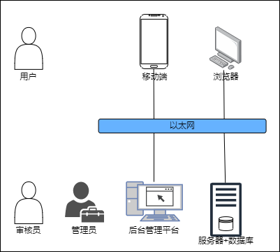

# outline design notes (概要设计说明)

> author: wjl 2022-11-12

> still needs to be improved

## 任务概述

### 目标

本项目是设计一个跨平台的计算机专业技术内容分享交流平台。

### 运行环境

计划服务端集中在一台约 2C4G 的运行着 Ubuntu 22.04 的云服务器上，申请域名进行网络访问。

网页端提供手机 APP 的下载地址。

### 需求概述

用户可以发布博客，对他人博客文章点赞、收藏、发表评论。

博客文章具有唯一一个分类，如按领域分类，有系统、算法、理论、人工智能等。

博客文章可以具有多个标签来方便用户来检索内容。

用户可以创建收藏夹来收藏用户认为看完有收获的文章，收藏夹可以分为公开和私密，公开收藏夹可以被其他用户收藏。

用户对自己或别人的文章建立专栏，比如一系列的技术入手教程，分门归类，便于读者阅读。

用户可以在线写文章，文章编辑器支持Markdown语法，支持一部分的LaTex语法，可以展现数学公式。

用户对不太满意的或者尚未完成的文章可以先存为草稿，暂不发布。

平台对用户上传的文章进行严格的审核制度，涉及敏感话题一律退回不予发布。

用户对其他用户的垃圾内容文章和评论也可以举报，帮助形成良好的社区讨论氛围。

### 条件与限制

服务器的网络带宽费用很高，带宽应该不会很高，如果出现很多用户访问，响应时间可能会很慢，需要耐心等待。

## 总体设计

### 处理逻辑

项目总体采用前后端分离开发，使用 JSON 传输数据，项目走 HTTPS 协议，无需对数据进行加密处理。

Web 后端服务器响应用户的请求，做出对应的操作。项目规模小的时候数据库和 Web 服务器集中在同一台设备上，不分开部署。

对于网页端应用，服务器上使用 NGINX 提供 HTTP 服务，移动端应用与网页端暂时共用同一 API 接口，简化开发流程。

项目提供一个网页端的后台管理平台，供管理员和审核员管理用户上传的内容。

### 总体结构和模块外部设计

