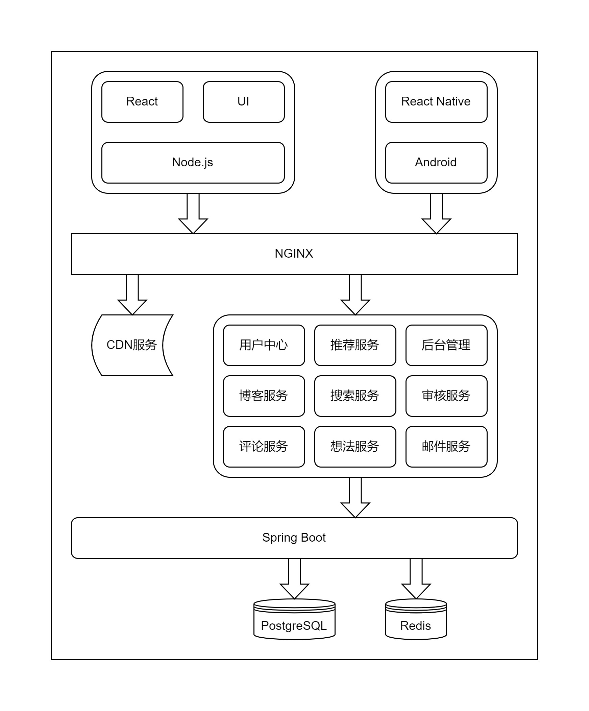

# Detailed design description

> author: wjl 2022-11-23

> still needs to be improved

## Overall Design

### Software Structure

The overall project adopts the structure development of front-end and back-end separation, and transmits information through data in JSON format.

- The backend is based on the Java technology stack, using Spring Boot and other web server development frameworks and tools.

- For data storage, PostgreSQL relational database and Redis are used as cache.

- Use the React front-end development library for the web page, and the UI library has not yet been determined.

- The mobile terminal only supports the Android platform for the time being, and is developed with React Native.

For the back-end part, because it is a stand-alone deployment, the development method of microservices is not used, but the project has a certain complexity and is divided into several modules internally.

1. CDN service: Use the object storage service provided by the cloud server manufacturer to upload static pictures, files, etc. to the object storage server, reducing the I/O processing pressure of the web server.

2. User Center: Provide login and registration services, record and process user information, and login status

3. Blog service: Provide users with blog services, including likes, favorites, reports, and posting blogs, etc.

4. Comment service: Provide comment service, process comments posted by users, comments support multi-level

5. Recommendation service: The home page recommends blogs or ideas to users based on certain indicators

6. Search service: Provide search service to meet certain search needs of users

7. Idea service: The service that provides users with ideas. This part has the same idea as the blog service part, but it lacks the unique classification and tags of blogs, which is relatively simple

8. Background management: Provide platform operators with a visual interface, count some indicators, and provide convenient management and maintenance operations

9. Audit service: This part can be incorporated into the background management service, temporarily

10. Mail service: a service for sending mail to users

