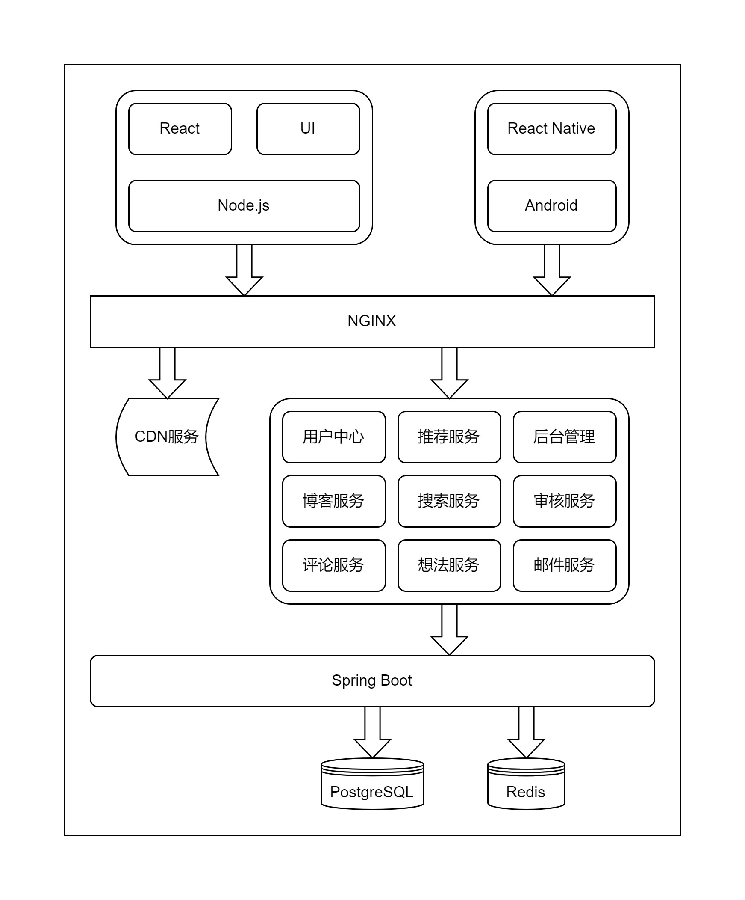

# 详细设计说明

> author: wjl 2022-11-23

> still needs to be improved

## 总体设计

### 软件结构

项目总体采用前后端分离的结构开发，通过 JSON 格式的数据传递信息。

- 后端基于 Java 技术栈，使用 Spring Boot 和其他 Web 服务端开发框架和工具。

- 数据存储方面选用 PostgreSQL 关系数据库和 Redis 做缓存。

- 网页端选用 React 前端开发库，UI 库暂时还没确定。

- 移动端暂时只支持 Android 平台，选用 React Native 开发。

对于后端部分，因为是单机部署，就不采用微服务的开发方式，但项目已经有一定的复杂度，内部划分为几个模块。

1. CDN 服务: 使用云服务器厂商提供的对象存储服务，将静态图片、文件等上传到对象存储服务器，降低web服务器的 I/O 处理压力。

2. 用户中心: 提供登录注册服务，记录、处理用户信息、及登录状态

3. 博客服务: 提供用户博客服务，包括点赞、收藏、举报、发布博客等

4. 评论服务: 提供评论服务，处理用户发表的评论，评论支持多级

5. 推荐服务: 首页根据一定的指标向用户推荐博客或者想法

6. 搜索服务: 提供搜索服务，做到能够满足用户一定的搜索需求

7. 想法服务: 提供用户想法的服务，这部分和博客服务部分思路一致，但少了博客特有的分类和标签，相对简单一点

8. 后台管理: 给平台运营人员一个可视化的界面，统计一些指标，提供方便管理维护的操作

9. 审核服务: 这部分可以并入后台管理服务中，暂时这样做

10. 邮件服务: 向用户发送邮件的服务

